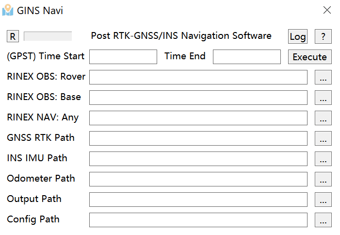

# GNSS/INS 组合导航GUI软件

GINS-Navi软件是一款基于ESKF的GNSS/INS松组合算法的组合导航软件，兼容windows(GUI)与Linux(CUI)。

[使用软件前，请务必仔细阅读“配置”信息。]

联系作者：刘恒祯，武汉大学，lewis5499@whu.edu.cn

## 1 配置

项目的配置文件为./conf目录下的*.conf，可通过配置文件提供详细的解算参数选择：

| **Section** | **Parameter**               | **Value**                      | **Description**                                                              |
|-------------|-----------------------------|--------------------------------|------------------------------------------------------------------------------|
| **Configure** | `navSys`                    | `nFrame`                       | Navigation frame, especially the INS mechanism                               |
|             | `usegnssvel`                | `true`                         | Whether use GNSS velocity update or not                                         |
|             | `useZUPT`                   | `false`                        | Whether use ZUPT detection and update or not                                     |
|             | `useodonhc`                 | `true`                         | Whether use ODO/NHC update or not (ODO not completed yet)                        |
|             | `usesinglenhc`              | `true`                         | Whether to use single NHC update or not                                             |
|             | `usesingleodo`              | `false`                        | Whether use single ODO update or not (ODO not completed yet)                     |
|             | `onlyinsmech`               | `false`                        | Whether use only the INS mechanism or not                                        |
| **IMU Settings** | `imudataformat`             | `asc`                          | IMU data format (0: imr, 1: asc, 2: txt[7 columns])                           |
|             | `imurawcoordinate`          | `RFU`                          | Raw IMU data in RFU or FRD                                                   |
|             | `imuInitStaticTime`         | `5.0`                          | IMU initial alignment time [min]                                             |
|             | `imuSamplingRate`           | `100.0`                        | IMU sampling rate [Hz]                                                       |
|             | `imuInitialGPSTWeek`        | `2315`                         | IMU initial GPS week                                                         |
|             | `useAttFromRoughAlign`      | `false`                        | Use initial attitude from rough alignment                                    |
| **GNSS Settings** | `useInitalPosVelFromRTK`    | `false`                        | Use initial position and velocity from RTK solution                          |
| **State Settings** | `estimateImuScale`          | `true`                         | Estimate IMU scale (21-dimension states if true, 15 if false)                 |
| **Plot Settings** | `plotResults`              | `true`                         | Use `matplotlib` to automatically plot navigation results                    |
| **File Paths** | `file-roverobs-renix`       | `F:\GINS-Navi\data\WHU20240522-XWGI7660\rover.24O` | Rover observation file path                 |
|             | `file-baseobs-renix`        | `F:\GINS-Navi\data\WHU20240522-XWGI7660\base.24O`  | Base observation file path                    |
|             | `file-navi-renix`           | `F:\GINS-Navi\data\WHU20240522-XWGI7660\base.24N`  | Navigation file path                          |
|             | `gnssfilepath`              | `F:\GINS-Navi\data\WHU20240522-XWGI7660\GNSS-RTK.txt` | GNSS file path                             |
|             | `imrfilepath`               | `F:\GINS-Navi\data\WHU20240522-XWGI7660\rover.imr` | IMR file path                              |
|             | `ascfilepath`               | `F:\GINS-Navi\data\WHU20240522-XWGI7660\rover.ASC` | ASC file path                              |
|             | `imutxtfilepath`            | ` `                            | IMU TXT file path                          |
|             | `odofilepath`               | ` `                            | ODO file path                             |
|             | `outputpath`                | `F:\GINS-Navi\data\WHU20240522-XWGI7660\` | Output path                                |
| **Initial Information** | `startweek`               | `2315`                         | Start week (or you can use 'auto')                       |
|             | `endweek`                 | `2315`                         | End week (or you can use 'auto')                         |
|             | `starttow`                 | `291724.0`                     | Start time of week (or you can use 'auto')              |
|             | `endtow`                   | `295006.0`                     | End time of week (or you can use 'auto')                |
|             | `initpos`                  | `[30.528078962, 114.355762445, 40.9652]` | Initial position [deg, deg, m] (derived from RTK results)     |
|             | `initvel`                  | `[-0.002, -0.838, -0.028]`     | Initial velocity [m/s] (derived from RTK results)         |
|             | `initatt`                  | `[0.183, 0.183, 272.55]`       | Initial attitude [deg] (not used if `useAttFromRoughAlign` is true)    |
|             | `initposstd`               | `[1.0, 1.0, 2.0]`              | Initial position standard deviation [m] (N-E-D)            |
|             | `initvelstd`               | `[0.5, 0.5, 0.5]`              | Initial velocity standard deviation [m/s]                   |
|             | `initattstd`               | `[0.5, 0.5, 1.0]`              | Initial attitude standard deviation [deg]                    |
|             | `initgyrbias`              | `[0.5, -1.0, 6.0]`             | Initial gyroscope bias [deg/h]                              |
|             | `initaccbias`              | `[-200, 700, 0]`               | Initial accelerometer bias [mGal]                           |
|             | `initgyrscale`             | `[0, 0, 0]`                    | Initial gyroscope scale [ppm]                               |
|             | `initaccscale`             | `[0, 0, 0]`                    | Initial accelerometer scale [ppm]                           |
|             | `initgyrbiasstd`           | `[50, 50, 50]`                 | Initial gyroscope bias standard deviation [deg/h]           |
|             | `initaccbiasstd`           | `[250, 250, 250]`              | Initial accelerometer bias standard deviation [mGal]        |
|             | `initgyrscalestd`          | `[1000.0, 1000.0, 1000.0]`     | Initial gyroscope scale standard deviation [ppm]            |
|             | `initaccscalestd`          | `[1000.0, 1000.0, 1000.0]`     | Initial accelerometer scale standard deviation [ppm]        |
|             | `gyrarw`                   | `[0.24, 0.24, 0.24]`           | Gyroscope angle random walk [deg/s/sqrt(h)]                 |
|             | `accvrw`                   | `[0.24, 0.24, 0.24]`           | Accelerometer velocity random walk [m/s/sqrt(h)]            |
|             | `gyrbiasstd`               | `[50.0, 50.0, 50.0]`           | Gyroscope bias standard deviation [deg/h]                   |
|             | `accbiasstd`               | `[250.0, 250.0, 250.0]`        | Accelerometer bias standard deviation [mGal]                |
|             | `gyrscalestd`              | `[1000.0, 1000.0, 1000.0]`     | Gyroscope scale standard deviation [ppm]                    |
|             | `accscalestd`              | `[1000.0, 1000.0, 1000.0]`     | Accelerometer scale standard deviation [ppm]                |
|             | `corrtime`                 | `1.0`                          | Correlation time [h]                                        |
| **Installation Parameters** | `antlever`                | `[0.164, -0.035, -0.890]`     | Antenna lever arm [m] (NED)                                 |
|             | `odolever`                | `[0.0, 0.0, 0.0]`              | Odometer lever arm [m]                                      |
|             | `installangle`            | `[0.0, 0.0, 0.0]`              | Installation angle [deg]                                     |
| **Measurement Noise** | `odonhc_measnoise`          | `[0.10, 0.07, 0.07]`           | ODO/NHC measurement noise [m/s]                             |
|             | `zupt_vmeasnoise`         | `[0.10, 0.10, 0.10]`           | ZUPT velocity measurement noise [m/s]                       |
|             | `zupt_wmeasnoise`         | `50`                           | ZUPT angular velocity measurement noise [deg/h]             |
|             | `CodeNoise`               | `4.0`                          | Code noise [m]                                              |
|             | `CPNoise`                 | `0.05`                         | Carrier phase noise [m]                                      |
| **Update Frequency** | `odonhcupdaterate`         | `1.0`                          | ODO/NHC update rate [Hz]                                    |
|             | `zuptupdaterate`          | `1.0`                          | ZUPT update rate [Hz]                                       |
| **RTK Post Options** | `pos1-posmode`             | `kinematic`                   | Positioning mode                                            |
|             | `pos1-frequency`          | `l1+2+3`                       | Frequency                                                   |
|             | `pos1-soltype`            | `combined`                     | Solution type                                               |
|             | `pos1-elmask`             | `10`                           | Elevation mask [deg]                                        |
|             | `pos1-snrmask_r`          | `off`                          | SNR mask for rover                                          |
|             | `pos1-snrmask_b`          | `off`                          | SNR mask for base                                           |
|             | `pos1-snrmask_L1`         | `0,0,0,0,0,0,0,0,0`            | SNR mask for L1                                             |
|             | `pos1-snrmask_L2`         | `0,0,0,0,0,0,0,0,0`            | SNR mask for L2                                             |
|             | `pos1-snrmask_L5`         | `0,0,0,0,0,0,0,0,0`            | SNR mask for L5                                             |
|             | `pos1-dynamics`           | `on`                           | Dynamics mode                                               |
|             | `pos1-tidecorr`           | `off`                          | Tidal correction                                            |
|             | `pos1-ionoopt`            | `brdc`                         | Ionospheric option                                          |
|             | `pos1-tropopt`            | `saas`                         | Tropospheric option                                         |
|             | `pos1-sateph`             | `brdc`                         | Satellite ephemeris option                                  |
|             | `pos1-posopt1`            | `off`                          | Positioning option 1                                        |
|             | `pos1-posopt2`            | `off`                          | Positioning option 2                                        |
|             | `pos1-posopt3`            | `off`                          | Positioning option 3                                        |
|             | `pos1-posopt4`            | `off`                          | Positioning option 4                                        |
|             | `pos1-posopt5`            | `off`                          | Positioning option 5                                        |
|             | `pos1-posopt6`            | `off`                          | Positioning option 6                                        |
|             | `pos1-exclsats`           | ` `                            | Excluded satellites                                         |
|             | `pos1-navsys`             | `59`                           | Navigation systems                                          |
|             | `pos2-armode`             | `off`                          | Ambiguity resolution mode                                   |
|             | `pos2-gloarmode`          | `on`                           | GLONASS AR mode                                             |
|             | `pos2-bdsarmode`          | `on`                           | BDS AR mode                                                 |
|             | `pos2-arthres`            | `3`                            | Ambiguity resolution threshold                              |
|             | `pos2-arthres1`           | `0.9999`                       | Ambiguity resolution threshold 1                            |
|             | `pos2-arthres2`           | `0.25`                         | Ambiguity resolution threshold 2                            |
|             | `pos2-arthres3`           | `0.1`                          | Ambiguity resolution threshold 3                            |
|             | `pos2-arthres4`           | `0.05`                         | Ambiguity resolution threshold 4                            |
|             | `pos2-arlockcnt`          | `0`                            | AR lock count                                               |
|             | `pos2-arelmask`           | `0`                            | Elevation mask for AR [deg]                                 |
|             | `pos2-arminfix`           | `10`                           | Minimum number of satellites for AR                         |
|             | `pos2-armaxiter`          | `1`                            | Maximum number of iterations for AR                         |
|             | `pos2-elmaskhold`         | `0`                            | Elevation mask for hold [deg]                               |
|             | `pos2-aroutcnt`           | `5`                            | Output count for AR                                         |
|             | `pos2-maxage`             | `60`                           | Maximum age of differential [s]                             |
|             | `pos2-syncsol`            | `off`                          | Synchronized solution                                       |
|             | `pos2-slipthres`          | `0.05`                         | Slip threshold [m]                                          |
|             | `pos2-rejionno`           | `30`                           | Ionospheric delay rejection threshold [m]                   |
|             | `pos2-rejgdop`            | `30`                           | GDOP rejection threshold                                    |
|             | `pos2-niter`              | `1`                            | Number of iterations                                        |
|             | `pos2-baselen`            | `0`                            | Base station length [m]                                     |
|             | `pos2-basesig`            | `0`                            | Base station sigma [m]                                      |
| **Output**  | `out-solformat`           | `llh`                          | Solution format                                             |
|             | `out-outhead`             | `on`                           | Output header                                               |
|             | `out-outopt`              | `on`                           | Output option                                               |
|             | `out-outvel`              | `on`                           | Output velocity                                             |
|             | `out-timesys`             | `gpst`                         | Time system                                                 |
|             | `out-timeform`            | `tow`                          | Time format                                                 |
|             | `out-timendec`            | `3`                            | Time decimal places                                         |
|             | `out-degform`             | `deg`                          | Degree format                                               |
|             | `out-fieldsep`            | ` `                            | Field separator                                             |
|             | `out-outsingle`           | `off`                          | Output single                                               |
|             | `out-maxsolstd`           | `0`                            | Maximum solution standard deviation [m]                     |
|             | `out-height`              | `geodetic`                     | Height reference                                            |
|             | `out-geoid`               | `internal`                     | Geoid model                                                 |
|             | `out-solstatic`           | `all`                          | Static solution                                             |
|             | `out-nmeaintv1`           | `0`                            | NMEA interval 1 [s]                                         |
|             | `out-nmeaintv2`           | `0`                            | NMEA interval 2 [s]                                         |
|             | `out-outstat`             | `off`                          | Output status                                               |
| **Statistics** | `stats-eratio1`            | `100`                          | Error ratio 1                                               |
|             | `stats-eratio2`            | `100`                          | Error ratio 2                                               |
|             | `stats-errphase`           | `0.003`                        | Phase error [m]                                             |
|             | `stats-errphaseel`         | `0.003`                        | Phase error elevation [m]                                   |
|             | `stats-errphasebl`         | `0`                            | Phase error baseline [m/10km]                               |
|             | `stats-errdoppler`         | `1`                            | Doppler error [Hz]                                          |
|             | `stats-stdbias`            | `30`                           | Standard bias [m]                                           |
|             | `stats-stdiono`            | `0.03`                         | Standard ionospheric error [m]                              |
|             | `stats-stdtrop`            | `0.3`                          | Standard tropospheric error [m]                             |
|             | `stats-prnaccelh`          | `1.0`                          | PRN acceleration horizontal [m/s²]                          |
|             | `stats-prnaccelv`          | `0.1`                          | PRN acceleration vertical [m/s²]                            |
|             | `stats-prnbias`            | `1e-05`                        | PRN bias [m]                                                |
|             | `stats-prniono`            | `0.001`                        | PRN ionospheric error [m]                                   |
|             | `stats-prntrop`            | `0.0001`                       | PRN tropospheric error [m]                                  |
|             | `stats-prnpos`             | `0`                            | PRN position error [m]                                      |
|             | `stats-clkstab`            | `5e-12`                        | Clock stability [s/s]                                       |
| **Antenna 1** | `ant1-postype`             | `llh`                          | Position type                                               |
|             | `ant1-pos1`                | `90`                           | Position 1 [deg|m]                                          |
|             | `ant1-pos2`                | `0`                            | Position 2 [deg|m]                                          |
|             | `ant1-pos3`                | `-6335367.6285`                | Position 3 [m|m]                                            |
|             | `ant1-anttype`             | ` `                            | Antenna type                                                |
|             | `ant1-antdele`             | `0`                            | Antenna delta E [m]                                         |
|             | `ant1-antdeln`             | `0`                            | Antenna delta N [m]                                         |
|             | `ant1-antdelu`             | `0`                            | Antenna delta U [m]                                         |
| **Antenna 2** | `ant2-postype`             | `llh`                          | Position type                                               |
|             | `ant2-pos1`                | `30.528231`                    | Position 1 [deg|m]                                          |
|             | `ant2-pos2`                | `114.356985`                   | Position 2 [deg|m]                                          |
|             | `ant2-pos3`                | `42.6548`                      | Position 3 [m|m]                                            |
|             | `ant2-anttype`             | ` `                            | Antenna type                                                |
|             | `ant2-antdele`             | `0`                            | Antenna delta E [m]                                         |
|             | `ant2-antdeln`             | `0`                            | Antenna delta N [m]                                         |
|             | `ant2-antdelu`             | `0`                            | Antenna delta U [m]                                         |
|             | `ant2-maxaveep`            | `0`                            | Maximum averaging epochs                                    |
|             | `ant2-initrst`             | `off`                          | Initial reset                                               |
| **Miscellaneous** | `misc-timeinterp`          | `off`                          | Time interpolation                                          |
|             | `misc-sbasatsel`           | `0`                            | SBAS satellite selection                                    |
|             | `misc-rnxopt1`             | ` `                            | RINEX option 1                                              |
|             | `misc-rnxopt2`             | ` `                            | RINEX option 2                                              |
|             | `misc-pppopt`              | ` `                            | PPP option                                                  |
|             | `file-satantfile`          | ` `                            | Satellite antenna file                                      |
|             | `file-rcvantfile`          | ` `                            | Receiver antenna file                                       |
|             | `file-staposfile`          | ` `                            | Station position file                                       |
|             | `file-geoidfile`           | ` `                            | Geoid file                                                  |
|             | `file-ionofile`            | ` `                            | Ionosphere file                                             |
|             | `file-dcbfile`             | ` `                            | DCB file                                                    |
|             | `file-eopfile`             | ` `                            | EOP file                                                    |
|             | `file-blqfile`             | ` `                            | BLQ file                                                    |
|             | `file-tempdir`             | ` `                            | Temporary directory                                         |
|             | `file-geexefile`           | ` `                            | GEE executable file                                         |
|             | `file-solstatfile`         | ` `                            | Solution status file                                        |
|             | `file-tracefile`           | ` `                            | Trace file                                                  |

## 2 程序编译与运行

### 2.1 源码及编译

项目采用CMake管理, ./include ./src目录下提供了所有源码。建议使用Mingw编译。

### 2.2 依赖库

windows下依赖WIN32 API以实现窗体, 第三方的Eigen库、MatPlotlib-cpp库、tqdm-cpp库、thread-pool库等内容均在./ThirdParty目录下。

CMakeLists已经配置完善，用户简单一步编译程序即可，推荐CLion IDE。

### 2.3 运行结果

配置中的“Output Path”设置了导航结果信息(含STD)、IMU误差信息(含STD)的输出路径，以及可视化结果(二维、三维轨迹、高程，姿态欧拉角组[RPY]，IMU零偏/比例因子误差及STD等)

### 2.4 可视化

本C++窗体程序调用了Matplotlib库进行自动的结果图绘制：二维平面轨迹、三维轨迹、vel/att、imu误差以及STD等。如果您觉得影响了效率，则可禁用之，请详见配置文件。

输出目录下的'nav_result.pos'文件对接rtklib标准，亦可以直接使用rtkplot.exe导入该文件进行RTK结果可视化。

## 3 数据集

### 3.1 测试数据

./data/ 目录下放置了六组不同精度IMU的数据，主要有：

LeadorA15（导航级，高精度），XWGI7680（战术级，中高精度），CHC CGI-430 （MEMS，低精度），InvenSense ICM-20602（MEMS，低精度）。

truth.nav为反向平滑的参考真值数据。

./conf/目录下存放了对应数据的配置文件

### 3.2 兼容的数据格式

兼容NovAtel公司的IMR、ASC格式数据，以及自定义的七列txt数据（请详见[i2nav开源数据集](https://github.com/i2Nav-WHU/awesome-gins-datasets)的说明）。

## 4 模块继承

提供了独立可继承的模块：可继承的进度条类(tqdm)、增删改查配置类(configManager)、文件读写类(fileloader/filesaver)、代数计算类(algebra)、绘图类(matplotlib-cpp)等等。

## 5 特色

同时兼容 win(GUI)、linux(CUI)，提供详细解算参数设置;

使用Windows原生API，进行轻量高效的GUI设计，仿rtklib窗体风格;

窗体具有 mailto 帮助，GUI progress bar，以及配置读写的容错处理;

从源代码层面集成 rtklib 的RTK后处理模块，算法高精，提供详尽的解算策略;

松组合核心代码纯面向对象思想(工厂模式/抽象/函数模版..., etc)，进行了详尽的容错处理，项目代码简洁;

使用了线程池并行提交任务，算法高效;

可继承的配置类、文件读写类、代数计算类、可继承的二次开发的 tqdm 进度条类，均为单头文件;

GNSS信息质量控制(观测信息)：例如设置可用的绝对阈值（与相对阈值），在启用 GNSS 位置、速度观测更新时，分别对 x、y、z 方向的数据进行约束，剔除某方向质量不好的数据

兼容asc imr txt 多种惯导数据;

跨周的容错处理(待测试);

提供 n 系 e 系编排的导航框架选择(e系编排有一个小bug仍未修复);

估计/不估计IMU比例因子(ESKF状态向量为21维/15维);

提供多数据集测试，算法鲁棒：导航级、战术级、MEMS;

... ...

。。。不想写了。。。看配置文件相信能够看得懂 (doge

算法是不完善的，反向编排没加，结果没进行平滑，

后续读研阶段计划继续深入研究组合领域，本科的内容还是比较浅，仅停留在复现阶段。
